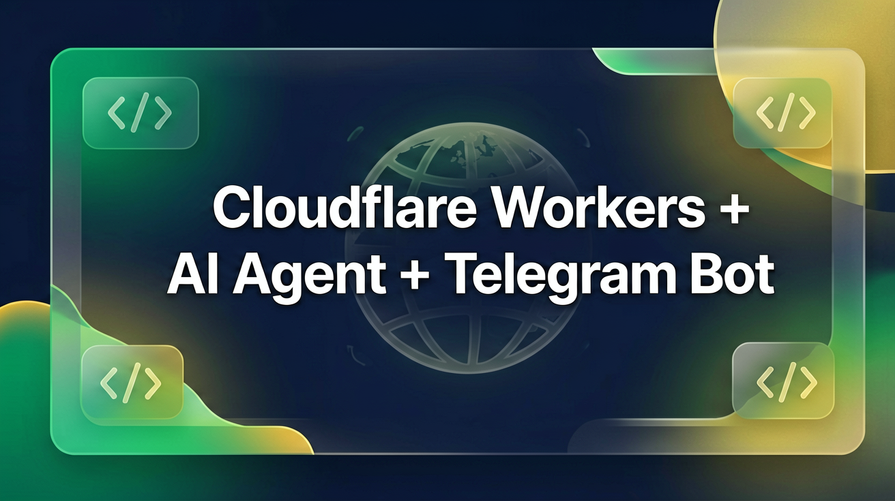

# 🚀 Tutorial: Cloudflare Workers + Pages + Bindings + AI Agent + Telegram Bot

**Panduan lengkap — dari 0 sampai deploy — untuk publik. No API keys, no credentials pribadi.**



> 🌐 **Bahasa:** Indonesia (mixed English tech terms)
> 🎯 **Target:** Developer/pemula yang mau belajar Cloudflare ecosystem + AI Agent + Telegram Bot
> 📅 **Last updated:** 2026-06-29
> 👤 **Author:** [Celebez](https://github.com/Celebez)

---

## 📑 Daftar Isi

1. [Apa itu Cloudflare Workers?](#-1-apa-itu-cloudflare-workers)
2. [Apa itu Cloudflare Pages?](#-2-apa-itu-cloudflare-pages)
3. [Bindings — D1, KV, R2, Queues, Durable Objects](#-3-bindings-apa-itu-dan-kegunaannya)
4. [Cara Deploy Workers (Manual + Wrangler CLI)](#-4-cara-deploy-workers)
5. [Cara Deploy Pages](#-5-cara-deploy-pages)
6. [Cara Setup AI Agent (Hermes Agent / Codex CLI)](#-6-cara-setup-ai-agent-di-vps)
7. [Cara Integrasi ke Telegram Bot](#-7-cara-integrasi-ke-telegram-bot)
8. [Tips & Best Practices](#-8-tips--best-practices)
9. [Troubleshooting Umum](#-9-troubleshooting-umum)
10. [Referensi & Link](#-10-referensi--link)

---

## 🤔 Apa itu Cloudflare Workers?

**Cloudflare Workers** = platform **serverless** dari Cloudflare yang jalanin JavaScript/TypeScript/Wasm di **edge** (100+ lokasi di seluruh dunia). Mirip AWS Lambda tapi:

- ✅ **Jalan di edge** — dekat user, latency rendah
- ✅ **Cold start ~5ms** — bukan detik
- ✅ **Free tier:** 100k request/hari
- ✅ **Language:** JavaScript, TypeScript, WASM, Python (via Pyodide)
- ✅ **Runtime:** Service Worker API + ES Modules

### Arsitektur Sederhana

```
User Browser → Cloudflare Edge (100+ lokasi) → Worker Code → D1/KV/R2/API
```

### Kapan Pakai Workers?

| Use Case | Cocok? |
|----------|--------|
| API proxy / rewrite | ✅ Sangat |
| Auth middleware | ✅ |
| A/B testing | ✅ |
| Telegram bot | ✅ |
| Full web app (React) | ⚠️ Bisa, tapi via Pages lebih cocok |
| Heavy ML inference | ❌ Batas CPU 10ms/request |

### Daftar Isi

1. [Apa itu Cloudflare Workers?](#-1-apa-itu-cloudflare-workers)
2. [Apa itu Cloudflare Pages?](#-2-apa-itu-cloudflare-pages)
3. [Bindings — D1, KV, R2, Queues, Durable Objects](#-3-bindings-apa-itu-dan-kegunaannya)
4. [Cara Deploy Workers (Manual + Wrangler CLI)](#-4-cara-deploy-workers)
5. [Cara Deploy Pages](#-5-cara-deploy-pages)
6. [Cara Setup AI Agent (Hermes Agent / Codex CLI)](#-6-cara-setup-ai-agent-di-vps)
7. [Cara Integrasi ke Telegram Bot](#-7-cara-integrasi-ke-telegram-bot)
8. [Tips & Best Practices](#-8-tips--best-practices)
9. [Troubleshooting Umum](#-9-troubleshooting-umum)
10. [Referensi & Link](#-10-referensi--link)

---

## 🧱 1. Apa itu Cloudflare Workers?

**Cloudflare Workers** = serverless platform yang jalanin kode di **edge network** Cloudflare. Bayangin:

- ✅ **Cold start ~5ms** (bukan detik kayak Lambda)
- ✅ **100+ lokasi** di seluruh dunia
- ✅ **Free tier:** 100k request/hari, 1MB source code
- ✅ **Bahasa:** JavaScript, TypeScript, Wasm, Python (via Pyodide)
- ✅ **Runtime:** Service Worker API + ES Modules

### Worker Sederhana (Hello World)

```javascript
// worker.js — ES Modules format
export default {
  async fetch(request, env, ctx) {
    return new Response("Hello dari Cloudflare Edge! 🌍", {
      headers: { "content-type": "text/plain" }
    });
  }
};
```

### Service Worker (Legacy) vs ES Module

| Feature | Service Worker | ES Module (ESM) |
|---------|---------------|-----------------|
| Syntax | `addEventListener('fetch', event => ...)` | `export default { async fetch(request, env, ctx) {...} }` |
| `export` | ❌ Tidak bisa | ✅ Bisa |
| `import` | ❌ Manual bundling | ✅ Native |
| D1 / Queue bindings | ❌ | ✅ Wajib |
| **Recommended** | ❌ Lamanya | ✅ ✅ ✅ |

---

## 🖥️ 2. Apa itu Cloudflare Pages?

**Cloudflare Pages** = hosting **static site** + **full-stack** (via Functions). Mirip Vercel/Netlify tapi semua di edge Cloudflare.

### Kelebihan Pages vs Worker

| Aspect | Pages | Worker |
|-------|------|--------|
| Static assets (HTML/CSS/JS) | ✅ Otomatis | ❌ Manual embed |
| Framework support (Next, React, Svelte) | ✅ Built-in build | ❌ Manual |
| Free tier | 500 build/mo, unlimited bandwidth | 100k req/day |
| Custom domain | ✅ **Free** | ✅ |

### Pages + Functions (Full Stack)

Pages bisa punya **backend Functions** yang jalan di Workers runtime:

```
/pages-project/
├── public/          ← static assets (dilayarin langsung)
│   ├── index.html
│   └── style.css
└── functions/       ← backend API
    ├── api/
    │   └── users.js
    └── _middleware.js
```

### Deploy Pages via CLI

```bash
# Build dulu
npm run build   # output ke dist/

# Deploy
npx wrangler pages deploy dist/ --project-name=my-project
```

**Output:** dapat URL `https://my-project.pages.dev` lalu bisa di-custom domain.

---

## 🔗 3. Bindings — Apa itu dan Kegunaannya

**Binding** = cara Workers/Pages ngakses resource Cloudflare lain. Ada 6 jenis utama:

### 3a. D1 — Database SQLite di Edge

**D1** = database **SQLite** di Cloudflare edge. Buat nyimpen data user, settings, logs.

**Contoh di wrangler.toml:**
```toml
[[d1_databases]]
binding = "DB"       # ← nama binding, dipakai di kode
database_name = "my-database"
database_id = "xxxx-xxxx-xxxx"
```

**Di kode Worker:**
```javascript
const result = await env.DB.prepare("SELECT * FROM users WHERE id = ?")
  .bind(userId).first();
```

**Kegunaan:** nyimpen data user, chat history, analytics, config.

### 3b. KV — Key-Value Cache

**Workers KV** = key-value store **global** dengan read caching. Baca cepat, write perlu waktu replikasi (~5-60 detik).

```toml
[[kv_namespaces]]
binding = "CACHE"
id = "xxxx"
```

```javascript
await env.CACHE.get("key");   // read
await env.CACHE.put("key", "value");  // write (async)
await env.CACHE.delete("key"); // delete
```

**Kegunaan:** cache API responses, config global, session tokens, rate limiting counters.

### 3c. R2 — Object Storage (S3-compatible)

**R2** = object storage **no egress fee** — lebih murah dari S3.

```toml
[[r2_buckets]]
binding = "BUCKET"   # jangan "ASSETS" — itu reserved untuk Pages static assets
bucket_name = "my-bucket"
```

```javascript
const object = await env.BUCKET.get("file.pdf");  // "ASSETS" reserved untuk Pages assets — pakai nama binding lain (mis. BUCKET)
```

**Kegunaan:** nyimpen file (gambar, video, dokumen), backup, log archives.

### 3d. Queues — Message Queue

**Queues** = **message queue** buat async processing. Kirim pesan, Worker lain process.

```toml
[[queues.producers]]
binding = "QUEUE"
queue = "my-queue"

[[queues.consumers]]
queue = "my-queue"
max_batch_size = 10
```

```javascript
// Producer (dalam fetch handler)
await env.QUEUE.send({ userId: 123, action: "register" });

// Consumer (queue consumer handler terpisah)
export default {
  async queue(batch, env) {
    for (const msg of batch.messages) {
      const { userId, action } = msg.body;
      // process...
    }
  }
};
```

### 3e. Durable Objects — Stateful Singleton

**Durable Objects** = **stateful** object di edge. Punya memory sendiri, bisa nyimpen state.

```toml
[[durable_objects.bindings]]
name = "COUNTER"
class_name = "Counter"
```

**Kegunaan:** WebSocket connections, real-time game state, coordination, locks.

### 3f. Secrets — Environment Variables Rahasia

```bash
echo "SECRET_VALUE" | wrangler secret put SECRET_NAME
# atau lewat dashboard
```

**Kegunaan:** API keys, tokens, password database — **tidak bisa dibaca balik** via API.

### Tabel Perbandingan

| Binding | Storage Type | Persistence | Latency | Free Tier |
|--------|-------------|------------|---------|-----------|
| **D1** | SQLite DB | ✅ Disk | ~100ms | 5GB |
| **KV** | Key-Value | ✅ Global cache | ~5-60ms read | 1GB |
| **R2** | Object store | ✅ S3 | ~50ms | 10GB |
| **Queues** | Message queue | ✅ Buffer | Async | 100k msg/mo |
| **Durable Objects** | Stateful | ✅ RAM+disk | <1ms | Included |
| **Secrets** | Env vars | ✅ Config | <1ms | Unlimited |

---

## 🚀 4. Cara Deploy Workers

Ada 3 cara deploy Workers:

### 4a. Via Wrangler CLI (Recommended)

```bash
# Install
npm install -g wrangler    # atau npx wrangler

# Login (browser — perlu)
npx wrangler login

# Atau pake API Key (headless — tanpa browser)
export CLOUDFLARE_API_KEY="cfk_..."       # Global API Key
export CLOUDFLARE_EMAIL="email@example.com"

# Init project
npx wrangler init my-worker --yes           # bikin template

# Edit wrangler.toml
# [[d1_databases]], [[kv_namespaces]], dll

# Deploy
npx wrangler deploy                           # ke workers.dev
npx wrangler deploy --route "domain.com/*"   # custom domain

# Test
curl https://my-worker.username.workers.dev/
```

### 4b. Via REST API (Manual — Tanpa Wrangler)

Kalau `wrangler login` error / butuh browser:

```bash
# Bunyinya kaya gini:
curl -X PUT "https://api.cloudflare.com/client/v4/accounts/ACCT_ID/workers/scripts/SCRIPT_NAME" \
  -H "X-Auth-Email: EMAIL" \
  -H "X-Auth-Key: CF_API_KEY" \
  -H "Content-Type: multipart/form-data; boundary=FORM" \
  --data-binary @upload.bin
```

**Lebih detail di `docs/manual-deploy.md`**

### 4c. Via GitHub Actions / CI/CD

**Contoh workflow (`.github/workflows/deploy.yml`):**

```yaml
name: Deploy Worker
on:
  push:
    branches: [main]

jobs:
  deploy:
    runs-on: ubuntu-latest
    steps:
      - uses: actions/checkout@v4
      - run: npm install
      - run: npx wrangler deploy
        env:
          CLOUDFLARE_API_TOKEN: ${{ secrets.CF_API_TOKEN }}
```

---

## 🖼️ 5. Cara Deploy Pages

### 5a. Via Git (Auto-deploy)

1. Push project ke GitHub
2. Login Cloudflare Dashboard → Workers & Pages → **Create**
3. Pilih **Pages** → **Connect Git**
4. Authorize → pilih repo → branch
5. Set build command: `npm run build`
6. Output directory: `dist/`
7. ✅ Auto-deploy setiap push

### 5b. Via Wrangler CLI

```bash
# Build
npm run build

# Deploy
npx wrangler pages deploy dist/ --project-name=my-pages

# List projects
npx wrangler pages project list
```

### 5c. Pages + Custom Domain

1. Pages project → **Settings** → **Custom domains**
2. Add domain → verify DNS
3. **Cloudflare handles SSL auto**

---

## 🤖 6. Cara Setup AI Agent di VPS

### 6a. Hermes Agent (Nous Research)

**Hermes Agent** = open-source AI agent framework. Bisa jadi:
- CLI chat assistant
- Discord/Telegram bot
- Coding assistant
- Multi-provider (Groq, OpenAI, Cloudflare, dll)

**Install:**
```bash
curl -fsSL https://raw.githubusercontent.com/NousResearch/hermes-agent/main/scripts/install.sh | bash
```

**Coba:**
```bash
hermes chat -q "Buatkan function untuk generate angka random"
```

**Dokumentasi:** [hermes-agent.nousresearch.com/docs](https://hermes-agent.nousresearch.com/docs)

**Provider yang didukung:**
- OpenAI / Groq / Claude / DeepSeek
- Cloudflare Workers AI
- NVIDIA Nemotron
- 20+ lainnya

### 6b. Codex CLI

**Codex CLI** = AI coding assistant dari OpenAI. Jalan di terminal, bisa:
- Baca/edit file
- Run commands
- Git operations

```bash
# Install — OpenAI Codex CLI lewat npm (BUKAN pip; "codex-cli" di PyPI itu wrapper Gemini, tool beda)
npm install -g @openai/codex

# Setup API key
export OPENAI_API_KEY="sk-..."

# Pakai
codex -p "Buatkan REST API endpoint untuk user CRUD"
```

### 6c. Kimchi Coding Agent

**Kimchi** = coding agent dari Cast AI. Spesialis:
- Bikin kode baru
- Refactor kode existing
- Multi-file changes

```bash
# Repo resmi: https://github.com/castai/opencode-kimchi (project Node.js, TIDAK ada install.sh)
# Ikuti panduan di README repo-nya untuk install (jangan curl|bash dari URL tak terverifikasi)

# Setup
export KIMCHI_API_KEY="castai_v1_..."

# Pakai
kimchi -p "Tambah logging ke semua endpoint"
```

### 6d. Perbandingan AI Agents

| Agent | Type | Provider | Best For |
|-------|------|---------|----------|
| **Hermes** | Framework | Multi (20+) | Umum, bot, orchestrasi |
| **Codex CLI** | CLI agent | OpenAI | Coding assistance |
| **Kimchi** | CLI agent | Cast AI | Refactor & repair |
| **Claude Code** | CLI agent | Anthropic | Complex reasoning |

---

## 💬 7. Cara Integrasi ke Telegram Bot

### 7a. Prasyarat

1. **Bot Token** — dari [@BotFather](https://t.me/BotFather)
2. **Worker atau VPS** — tempat jalanin kode
3. **Webhook URL** — endpoint public untuk receive update

### 7b. Webhook Pattern

```javascript
// worker.js — Minimal Telegram Bot via Webhook
export default {
  async fetch(request, env) {
    const update = await request.json(); // dari Telegram

    // Handle pesan
    if (update.message?.text) {
      const chatId = update.message.chat.id;
      const text = update.message.text;

      // Balas
      await fetch(`https://api.telegram.org/bot${env.BOT_TOKEN}/sendMessage`, {
        method: "POST",
        headers: { "content-type": "application/json" },
        body: JSON.stringify({
          chat_id: chatId,
          text: `Kamu bilang: ${text}`
        })
      });
    }

    return new Response("ok");
  }
};
```

**Set webhook:**
```bash
curl -X POST "https://api.telegram.org/botTOKEN/setWebhook" \
  -d "url=https://my-worker.workers.dev/"
```

> 📦 **Kode runnable ada di `examples/`** — `worker.js` (echo bot) + `wrangler.toml` yang beneran bisa `wrangler deploy`. Lihat `examples/README.md`.

### 7c. Pattern Lain

- **Polling** — Cocok buat lokal/VPS (bukan serverless)
- **Long Polling** — Telegram nyimpen update sampe diambil
- **Gateway** — Hermes Agent punya gateway untuk multi-platform

### 7d. Bot Features yang Bisa Dibuat

| Feature | Butuh | Notes |
|---------|-------|------|
| Reply inline keyboard | `inline_keyboard` | UI reply di chat |
| Scheduled posts | Cron | `@daily` / `@hourly` |
| Media download | R2 + ffmpeg | Video processing |
| Database | D1 | User data, settings |
| Payment/Donate | Stripe | Payment button |
| Admin panel | Pages + D1 | Web dashboard |

---

## 💡 8. Tips & Best Practices

### 8a. Worker Tips

- **Gunakan ES Modules** — `export default` bukan `addEventListener`
- **Batasi 1MB source** — di free plan. Kalau lebih, embed di code atau pake R2
- **Handle error di fetch** — jangan throw langsung
- **Gunakan `ctx.waitUntil()`** — untuk background tasks (logging, analytics)

### 8b. D1 Tips

- **`sqlite_master` + `PRAGMA table_info` bisa kena SQLITE_AUTH** — jangan query ini di D1, pake `SELECT COUNT(*)` aja
- **Batch query** — pake `prepare()` + `bind()`, bukan raw string
- **Migration** — pake `wrangler d1 migrations`

### 8c. KV Tips

- **Write perlu ~5-60 detik** — jangan expect `get` after `put` langsung
- **Cache read** — `get` dengan `cacheTtl` > 0
- **Batch** — `put`/`get` banyak sekaligus pake `Promise.all`

### 8d. Security

- **Jangan pernah hardcode token** di kode — pake **secrets** atau **env vars**
- **CORS** — Set `Access-Control-Allow-Origin` yang strict
- **Rate limiting** — pake KV atau Durable Objects

---

## 🐛 9. Troubleshooting Umum

### Error 1101 — Runtime Exception

**Worker crash pas startup.** Biasanya karena:
- Circular imports (module A import B, B import A)
- Syntax error di module level
- Binding salah nama

**Fix:**
1. Rollback ke version sebelumnya
2. Test satu file dulu
3. Jangan batch edit > 5 file sekaligus

### Error 10021 — Bad Content-Type

**Waktu deploy ESM Worker.** Fix:
```bash
# Harus application/javascript+module
Content-Type: application/javascript+module
```

### SQLITE_AUTH — D1 Error

**Worker bisa query tapi error.** Fix:
- Jangan pake `sqlite_master` or `PRAGMA` — itu gak didukung
- Ganti ke `SELECT COUNT(*)`

### Error Key Denied Access — CapSolver

**CapSolver key valid tapi error.** Fix:
- Buka dashboard CapSolver → redeem key
- Atau pake alternatif (2Captcha)

### DNS Propagation

**Deploy udah selesai tapi belum muncul.** Fix:
- Tunggu ~1-5 menit
- Cek via curl dengan `-sSL` (ikuti redirect)
- `HTTP 308` = permanent redirect (BUKAN indikator sukses). Deploy sukses = `200 OK`. 308 wajar saat CF redirect, tapi jangan dianggap "berhasil deploy"

### CORS

**Worker tapi CORS blocked.** Fix:
```javascript
new Response(body, {
  headers: { "access-control-allow-origin": "*" }
});
```

---

## 📚 10. Referensi & Link

### Official Docs
- [Cloudflare Workers Docs](https://developers.cloudflare.com/workers/)
- [Cloudflare Pages Docs](https://developers.cloudflare.com/pages/)
- [Wrangler CLI](https://developers.cloudflare.com/workers/wrangler/)
- [D1 Database](https://developers.cloudflare.com/d1/)
- [Workers KV](https://developers.cloudflare.com/kv/)
- [R2 Storage](https://developers.cloudflare.com/r2/)
- [Queues](https://developers.cloudflare.com/queues/)
- [Durable Objects](https://developers.cloudflare.com/durable-objects/)

### AI Agent
- [Hermes Agent](https://hermes-agent.nousresearch.com/docs/)
- [Nous Research](https://nousresearch.com)
- [Codex CLI](https://github.com/openai/codex-cli)
- [Kimchi](https://github.com/castai/kimchi)

### Telegram
- [Bot API](https://core.telegram.org/bots/api)
- [@BotFather](https://t.me/BotFather)
- [Telegram Bot Examples](https://github.com/python-telegram-bot/python-telegram-bot)

### Tools
- [curl](https://curl.se/) — HTTP requests
- [jq](https://jqlang.github.io/jq/) — JSON parser di CLI
- [Wrangler TOML reference](https://developers.cloudflare.com/workers/wrangler/configuration/)

---

## 📦 Struktur Repo

```
tutorial-cloudflare-agents-bot/
├── README.md              ← Ini — tutorial utama
├── docs/                   ← Dokumen tambahan
│   ├── manual-deploy.md   ← Deploy via REST API manual
│   ├── d1-tips.md        ← D1 database tips & pitfalls
│   └── bindings-guide.md ← Panduan lengkap bindings
├── examples/               ← Kode runnable (beneran bisa deploy)
│   ├── worker.js         ← Telegram echo bot (ESM)
│   ├── wrangler.toml     ← Config + contoh binding
│   └── README.md         ← Cara jalanin
└── .gitignore              ← File git
```

---

## ⚠️ Disclaimer

Repo ini **100% tutorial publik** — **tidak ada API key, credential, atau data pribadi** di dalamnya. Semua contoh pake placeholder (`YOUR_TOKEN`, `your-email@example.com`, dll).

**Jangan commit credentials ke git!** — Udah include `.gitignore` untuk jaga-jaga.

---

*Dibuat dengan ❤️ oleh [Celebez](https://github.com/Celebez) — untuk komunitas, by komunitas.*